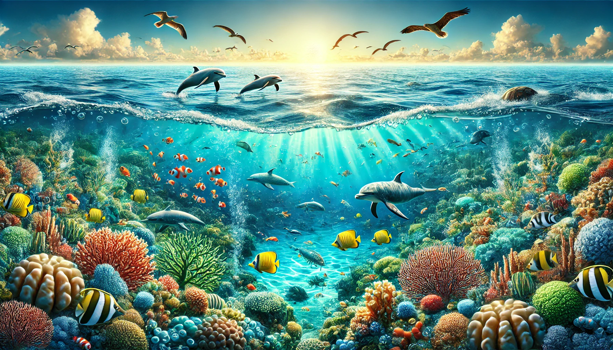

# Climat & Environnement — Analyses Scientifiques

Site d'analyses scientifiques sur les enjeux climatiques et environnementaux, basé sur des données publiques (GIEC, FAO, IEA, NASA).

**Site en ligne :** [ecosystemes-marins.netlify.app](https://ecosystemes-marins.netlify.app/)

---

## 🌍 Déclaration Planète Saine

<p align="center">
  
</p>

<p align="center">
  <strong>Téléchargez la carte gratuitement et partagez-la.</strong><br>
  Choisir d'arrêter la consommation de viande et de poisson,<br>
  c'est contribuer à un futur plus sain pour la planète et pour les générations à venir.
</p>

<p align="center">
  <a href="https://ecosystemes-marins.netlify.app/declaration.html">
    👉 Télécharger la carte — Déclaration Planète Saine
  </a>
</p>

---

## Pages

| Page | Sujet |
|------|-------|
| [Accueil](index.html) | Présentation générale et chiffres clés |
| [Déclaration Planète Saine](declaration.html) | Alerte scientifique — effondrement océanique 2050. Carte gratuite à télécharger et partager |
| [Phytoplancton](phytoplancton.html) | Déclin du phytoplancton océanique — projections 2026-2100 et impact sur l'oxygène |
| [Voiture vs Baleine](voiture_baleine.html) | Comparaison de l'impact écologique d'une voiture face aux services écosystémiques d'une baleine |
| [Captivité des Cétacés](captivite_cetaces.html) | Impact des parcs aquatiques sur les écosystèmes marins |
| [Accord UE-Mercosur](mercosur.html) | Déforestation amazonienne et scénarios 2026-2050 |
| [Consommation Alimentaire](consommation.html) | Comparaison France / Allemagne / USA : viande, poisson, végétarisme |
| [Tech vs Agroalimentaire](tech_vs_agro.html) | Comparaison factuelle des impacts écologiques du numérique vs l'agriculture |

---

## Structure

```
site/
├── index.html
├── style.css
├── sitemap.xml
├── declaration.html
├── phytoplancton.html
├── voiture_baleine.html
├── captivite_cetaces.html
├── mercosur.html
├── consommation.html
├── tech_vs_agro.html
└── images/
    ├── declaration_planete_saine.webp
    └── ...
```

## Sources

Les données utilisées proviennent de sources publiques : GIEC, FAO, IEA, NASA, et études scientifiques citées dans chaque page.
