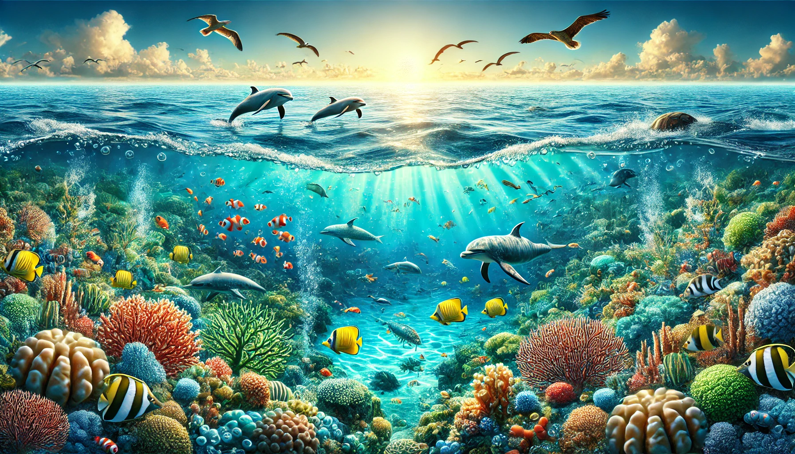

# Climat & Environnement — Analyses Scientifiques

**Site en ligne :** [gaby-ridaya.github.io/Climat](https://gaby-ridaya.github.io/Climat/)

Un site de vulgarisation scientifique qui rend accessibles les grands enjeux écologiques
— climat, océans, biodiversité, alimentation, inégalités — à partir de données publiques
et d'études scientifiques, traduites en graphiques clairs et en textes courts.

Conçu et réalisé par **Gabriel Alba**.

---

## Pourquoi ce projet

Il est insupportable de laisser aux générations futures une planète dégradée, traitée comme
une poubelle. S'il y a un combat à mener, c'est celui-là que j'ai choisi.

Ce site est ma façon d'y contribuer : rassembler des faits solides, les vérifier, et les
présenter de manière à ce que chacun puisse les comprendre et s'en emparer.

---

## Démarche

1. **Partir des sources** — chaque chiffre provient d'une source identifiée, citée en bas de page.
2. **Analyser les données** — les données brutes sont traitées et mises en graphique avec **Python**.
3. **Vulgariser** — chaque étude raconte une idée principale, illustrée par quelques graphiques
   et expliquée en langage simple.
4. **Corriger publiquement** — quand une erreur est identifiée, la page est corrigée et la
   correction est signalée (exemple : *Voiture vs Baleine*, correction de juillet 2026).

> **Un site en évolution.** Ces analyses ne sont pas figées : je reviens régulièrement sur
> chaque étude pour corriger une erreur ou intégrer des données plus récentes et plus justes
> dès que j'en trouve.

### Choix des sources

- **En priorité, les organismes officiels et institutions scientifiques** : GIEC, FAO, OCDE,
  Eurostat, AIE, NASA, NOAA, Inserm, INRAE-Ifremer, Commission européenne, USDA, FMI.
- **Les études publiées par des chercheurs reconnus**, lorsqu'elles font référence dans leur
  domaine — par exemple les travaux de Joe Roman et James McCarthy sur la
  [« pompe à baleines »](https://doi.org/10.1371/journal.pone.0013255) (PLoS ONE, 2010).
- **Certaines sources indépendantes** (observatoires, ONG, bases de données ouvertes) lorsqu'elles
  sont transparentes sur leur méthode, et en les recoupant avec d'autres sources.
- Les impacts sont exprimés autant que possible en **grandeurs physiques** (tonnes, hectares,
  kg par personne) plutôt qu'en valeurs monétaires, pour mesurer l'impact écologique réel.

---

## Les études

| Étude | Sujet |
|-------|-------|
| [Phytoplancton](https://gaby-ridaya.github.io/Climat/phytoplancton.html) | Déclin du phytoplancton océanique, rôle des baleines, projections 2026-2100 |
| [Voiture vs Baleine](https://gaby-ridaya.github.io/Climat/voiture_baleine.html) | Coût écologique d'une voiture face aux services rendus par une baleine |
| [Captivité des Cétacés](https://gaby-ridaya.github.io/Climat/captivite_cetaces.html) | Impact des parcs aquatiques sur les écosystèmes marins |
| [Accord UE-Mercosur](https://gaby-ridaya.github.io/Climat/mercosur.html) | Déforestation amazonienne, exports de soja et de bœuf, scénarios 2026-2050 |
| [Consommation Alimentaire](https://gaby-ridaya.github.io/Climat/consommation.html) | France, Allemagne, USA : viande, poisson, végétarisme |
| [Numérique](https://gaby-ridaya.github.io/Climat/tech_vs_agro.html) | Impacts écologiques du numérique comparés à ceux de l'agriculture |
| [Émissions & Revenu](https://gaby-ridaya.github.io/Climat/emissions_revenu.html) | Le revenu, plus que la population, explique l'empreinte carbone d'un pays |
| [Grande Distribution](https://gaby-ridaya.github.io/Climat/grande_distribution.html) | Gaspillage alimentaire et pesticides dans l'agroalimentaire français |
| [Populations en Déclin](https://gaby-ridaya.github.io/Climat/declin_populations.html) | Espèces indicatrices suivies en Europe, espèce par espèce |
| [Pesticides](https://gaby-ridaya.github.io/Climat/pesticides.html) | Santé (expertise Inserm 2021) et biodiversité (expertise INRAE-Ifremer 2022) |
| [Concentration des richesses](https://gaby-ridaya.github.io/Climat/concentration_richesses.html) | Patrimoine des 500 plus grandes fortunes de France comparé au PIB et aux budgets écologiques |

---

## 🌍 Déclaration Planète Saine

<p align="center">
  
</p>

<p align="center">
  Choisir d'arrêter la consommation de viande et de poisson,<br>
  c'est contribuer à un futur plus sain pour la planète et pour les générations à venir.
</p>

<p align="center">
  <a href="https://gaby-ridaya.github.io/Climat/declaration.html">
    👉 Voir la carte — Déclaration Planète Saine
  </a>
</p>

---

## Réalisation technique

- **Analyse et graphiques** : Python
- **Site** : HTML et CSS, sans framework, adapté aux écrans de téléphone
- **Hébergement** : GitHub Pages

```
├── index.html          Page d'accueil
├── declaration.html    Déclaration Planète Saine
├── *.html              Une page par étude
├── style.css           Feuille de style commune
├── sitemap.xml
└── images/             Graphiques générés en Python
```

---

## Contact

Gabriel Alba — [gabriel.dataanalysi@outlook.fr](mailto:gabriel.dataanalysi@outlook.fr)

Contenu sous licence [MIT](LICENSE).
